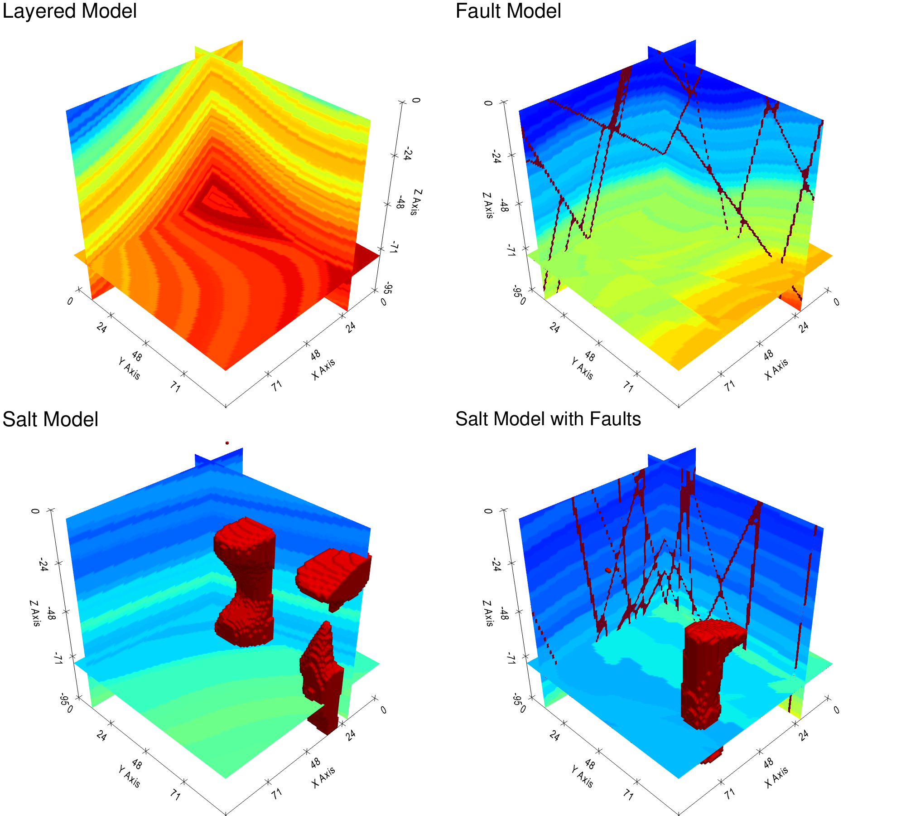
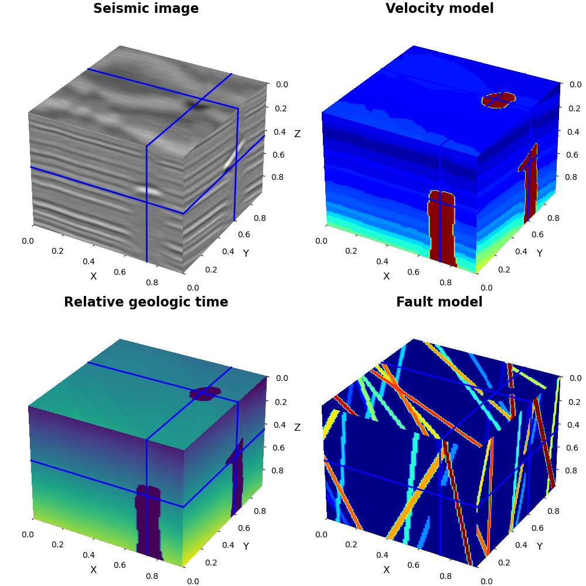
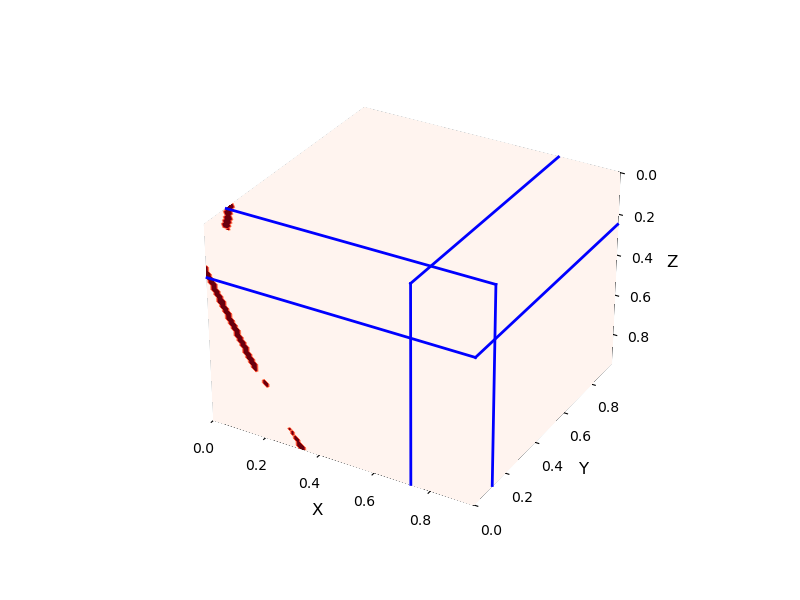
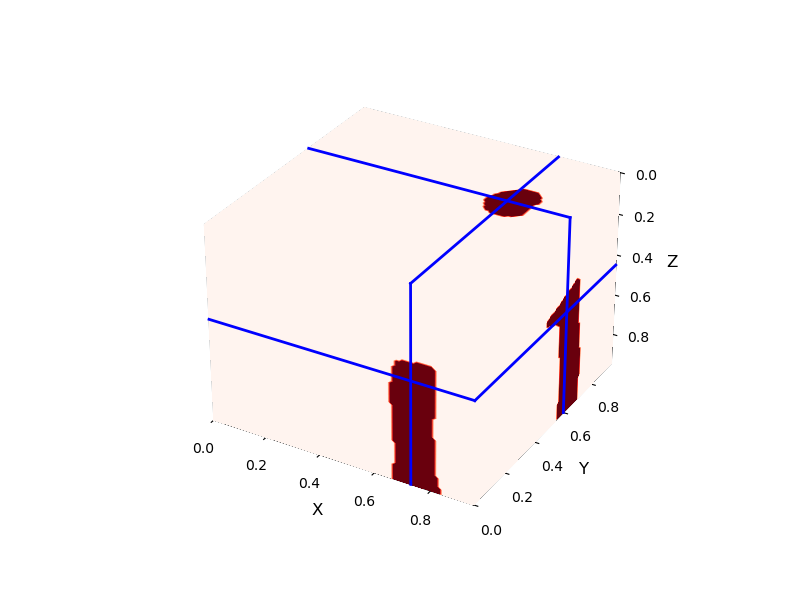

# GeoFWI3D

Large-scale 3D velocity models for deep-learning full waveform inversion (FWI) and other seismic processing workflows.



## Overview

**GeoFWI3D** provides many synthetic 3D Earth models, each stored as raw `float32` (little-endian) binaries. Per model you get:

| File | Contents |
|------|----------|
| `vp3d.bin` | P-wave velocity |
| `image3d.bin` | Seismic image |
| `rgt3d.bin` | Relative geologic time (RGT) |
| `fault3d.bin` | Fault index mask |

Each volume has shape **96 × 96 × 96** in **(X, Y, Z)** order. On disk the layout is contiguous C-order over those dimensions.

## Download

Compressed archives are hosted on Box:

[Download GeoFWI3D data](https://utexas.box.com/s/ybzgil0u3hvgusoc27bechxibyck88jr)

Each `models_batch_*.tar.gz` contains **1000** models. Place the archive files in the same directory as this repository, then extract.

## Extract

From the repository root:

```bash
./extract_models.sh
```

This creates `allmodels/` and extracts every `models_batch_*.tar.gz` into it.

## Directory layout

After extraction, models look like:

```text
allmodels/
├── model_0000/
│   ├── image3d.bin
│   ├── vp3d.bin
│   ├── rgt3d.bin
│   └── fault3d.bin
├── model_0001/
│   └── ...
└── ...
```

Folder names use four-digit zero padding: `model_0000`, `model_0001`, …

## Quick start

1. Install Python dependencies used by the example notebook: NumPy, Matplotlib, and scikit-image (for `marching_cubes`).
2. Run Jupyter with working directory [`quick_start/`](quick_start/) so `from plotting import plot3d` works. Open [`read_data.ipynb`](quick_start/read_data.ipynb): it defines `read_models`, sets `data_root` / `model_folders` / `shape`, and walks through loading and plotting.

```python
image1, vp1, rgt1, fault1 = read_models(data_root, model_folders, 1872)

fig, ax = plt.subplots(
    2, 2,
    figsize=(10, 10),
    subplot_kw={"projection": "3d"},
    constrained_layout=True,
)
axes = ax.ravel()

data_list = [image1, vp1, rgt1, fault1]
titles = ["Seismic image", "Velocity model", "Relative geologic time", "Fault model"]
cmaps = ["gray", "jet", "viridis", "jet"]

ix, iy, iz = 0, 0, 0
x_coords, y_coords, z_coords = np.arange(shape[0]), np.arange(shape[1]), np.arange(shape[2])

for ax, data, title, cmap_name in zip(axes, data_list, titles, cmaps):
    ax.set_title(title, fontsize=16, fontweight="bold", pad=15)
    plt.sca(ax)
    plot3d(
        data.T,
        cmap=cmap_name,
        frames=[45, 73, 60],
        ifnewfig=False,
        showf=False,
        close=False,
        ifinside=False,
    )

plt.show()
```



`fault3d.bin` stores a **fault index** per voxel. To plot a single fault (here index `3`):

```python
fault_mask = fault1.T == 3
plot3d(
    fault_mask.astype(np.float32),
    cmap="Reds",
    frames=[25, 73, 12],
    ifnewfig=True,
    showf=False,
    close=False,
    ifinside=False,
)
```



Salt bodies have **RGT = 0** in `rgt3d.bin`. Mask and plot with:

```python
salt_mask = rgt1.T == 0
plot3d(
    salt_mask.astype(np.float32),
    cmap='Reds',
    frames=[45, 73, 60],
    ifnewfig=True,
    figname="./gallery/salt_mask.png",
)
```




---

*Plotting helpers in `quick_start/plotting.py` are adapted from pyseistr (https://github.com/aaspip/pyseistr) utilities.*
