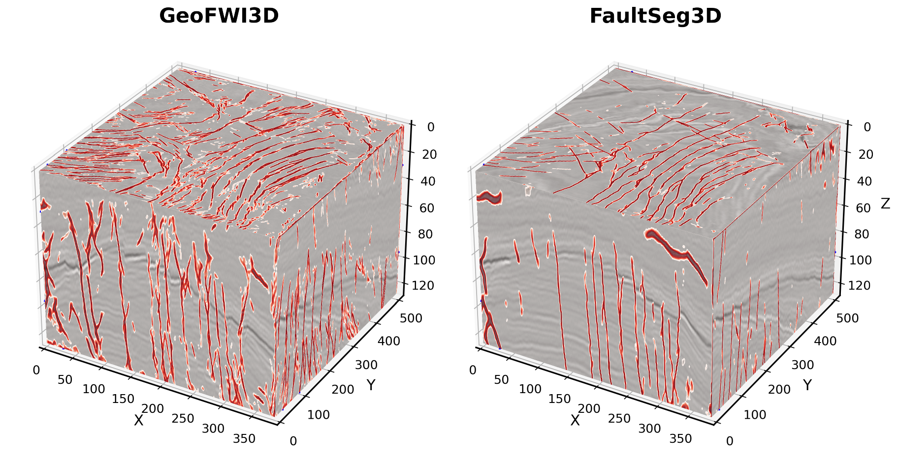

# Fault Segmentation

This folder contains experiments for **3D fault segmentation** from seismic volumes. The task is the same across the subdirectories:

- **Input:** a 3D seismic image volume
- **Target:** a **binary** fault mask

In both training pipelines, any nonzero fault label is converted to `1`, so the model learns **fault vs. non-fault**, not the original fault index IDs.

## What each directory does

### `faultSeg3d/`

Adapted from the original [FaultSeg3D repository](https://github.com/xinwucwp/faultSeg). This folder keeps the same overall task and a very similar setup, with small local changes to match this project.

Download the prepared FaultSeg3D data from [Google Drive](https://drive.google.com/drive/folders/1FcykAxpqiy2NpLP1icdatrrSQgLRXLP8) and place it under `faultseg3d/` so the expected `data/train/...` and `data/validation/...` folders are available.

Baseline training pipeline for the original FaultSeg3D-style data layout.

- `train.py` trains the model and writes checkpoints to `check1/`
- `unet3.py` defines the network
- `utils.py` loads `.dat` volumes, applies normalization and augmentation, and converts labels to binary masks

### `geofwi3d/`

GeoFWI3D version of the same training pipeline.

- `move_files.py` prepares local training files by copying `image3d.bin` and `fault3d.bin` from GeoFWI3D models into numbered `.dat` files
- `train.py` uses the same training loop and the same network architecture as `faultSeg3d/`
- `unet3.py` defines the same simplified 3D U-Net
- `utils.py` uses the same generator logic

In other words, these directories are mainly **separate experiment folders**, not different model families. The core network is the same; the main difference is **which dataset the model is trained on and how that dataset is prepared**.

### `prediction.ipynb`

Notebook for loading trained checkpoints and comparing predictions from the two experiment folders.

## Model and training setup

Both `faultSeg3d/` and `geofwi3d/` use the same setup:

- a simplified **3D U-Net** in `unet3.py`
- input patches of size `96 x 96 x 96`
- `Adam` optimizer with learning rate `1e-4`
- `binary_crossentropy` loss
- batch size `1`
- checkpoint output under `check1/`

The data loader also:

- center-crops or pads volumes to `96 x 96 x 96`
- applies random flips
- optionally injects Gaussian noise into the seismic input
- normalizes the seismic volume before training

## Expected data layout

Each experiment directory expects its own local data folders, for example:

```text
faultSeg3d/
├── data/
│   ├── train/
│   │   ├── seis/
│   │   └── fault/
│   └── validation/
│       ├── seis/
│       └── fault/
```

and similarly for `geofwi3d/`.

Files are read as numbered `.dat` volumes such as `0.dat`, `1.dat`, and so on.

## GeoFWI3D workflow

For the `geofwi3d/` experiment, the intended workflow is:

1. Download and extract the GeoFWI3D models in the repository root.
2. Use `geofwi3d/move_files.py` to copy selected `image3d.bin` and `fault3d.bin` files into local training and validation folders.
3. Run `geofwi3d/train.py`.
4. Compare results with the `faultSeg3d/` model in `prediction.ipynb`.

## Comparison of model prediction on F3 data

